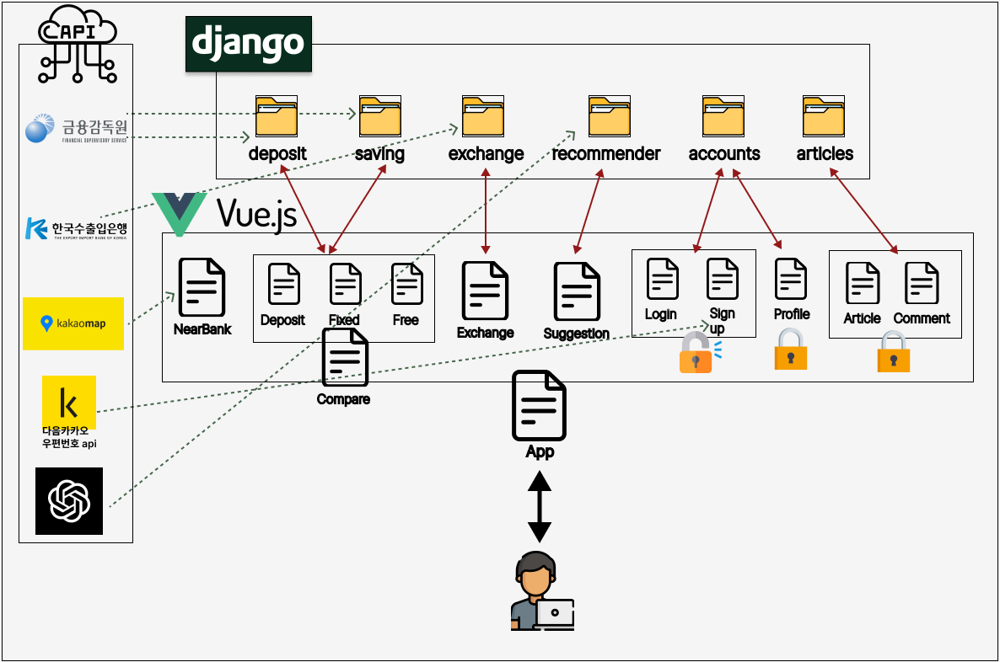

# 금융 프로젝트

## 프로젝트 역할
- 팀장: 전태호 (Front-End)
- 팀원: 오현진 (Back-End) 

## overview
### 메인 기능 
1. 예금 & 적금 금리비교 사이트
2. 환율변환
3. 근처은행
4. chatGPT를 이용한 상품 추천
5. 게시판

### 사용한 프레임워크
- 
- 

### 사용한 기술
- Pinia (state관리 라이브러리)
- chart.js, vue-chartjs (vue에서 그래프출력)
- dj-rest-auth (django 로그인 회원가입관련 라이브러리)

### 사용한 API
- KaKaoMap API (근처은행검색에 사용)
- 다음카카오 우편번호 API (회원가입시 주소검색에 사용)
- 한국수출입은행 환율정보 API (환율변환에 사용)
- 금융감독원 API (예/적금 금리비교에 사용)
- chatGPT API (금융상품추천에 사용)

## 설계 구조 

### Front
```
📦views
 ┣ 📂articles ( 게시글 관련 )
 ┃ ┣ 📜ArticlesView.vue
 ┃ ┣ 📜ArticlesViewAll.vue
 ┃ ┣ 📜ArticlesViewCreate.vue
 ┃ ┣ 📜ArticlesViewdetail.vue
 ┃ ┗ 📜ArticlesViewUpdate.vue
 ┣ 📂users  ( 사용자 관련 )
 ┃ ┣ 📜LoginView.vue
 ┃ ┣ 📜ProfileView.vue
 ┃ ┗ 📜SignUpView.vue
 ┣ 📜CompareView.vue  (예/적금 비교 관련 )
 ┣ 📜CompareViewDeposit.vue ( 예금 비교 )
 ┣ 📜CompareViewFixedSaving.vue ( 정기적금 비교 )
 ┣ 📜CompareViewFreeSaving.vue  ( 자유적금 비교 )
 ┣ 📜ExchangeView.vue ( 환율변환 )
 ┣ 📜MainPageView.vue 
 ┣ 📜NearBankView.vue ( 근처은행 )
 ┗ 📜SuggestionView.vue ( chatGPT를 활용한 금융상품 추천)

 📦components
 ┣ 📂comments ( 게시글의 댓글 관련 )
 ┃ ┣ 📜CommentCreate.vue
 ┃ ┗ 📜CommentsAll.vue
 ┣ 📜createChart.vue  ( 환율변환의 차트 생성 )
 ┣ 📜DepositDetail.vue  ( 금융상품의 상세정보페이지 )
 ┗ 📜KaKaoMap.vue ( 근처은행 검색시 KaKaoMap API 사용 )
 ```

###  Back
```
📦back
 ┣ 📂accounts (User model)
 ┣ 📂articles (게시글, 댓글)
 ┣ 📂back (장고 프로젝트)
 ┣ 📂deposit (예금)
 ┣ 📂exchange (환율)
 ┣ 📂fixtures (데이터 파일 폴더)
 ┃ ┣ 📜deposit_data.json
 ┃ ┗ 📜saving_data.json
 ┣ 📂recommender (추천 서비스)
 ┣ 📂saving (정기적금, 자유적금)
 ┣ 📂venv
 ┣ 📜.env
 ┣ 📜.gitignore
 ┣ 📜db.sqlite3
 ┣ 📜manage.py
 ┗ 📜requirements.txt
```
## 프로젝트 아키텍쳐


## [데이터베이스 모델링(ERD)](https://github.com/Taehororo/finance_pjt/blob/master/E-R%20diagram.md)


## ChatGPT API를 활용한 금융 상품 추천

1. 사용자는 원하는 금융 상품 종류(예금 or 정기적금 or 자유적금)를 선택하고 그 중 원하는 상품을 얻기위해 메시지를 입력함. 
<br>
(ex. 1년동안 1000만원을 가지고 저축할 상품을 추천해주세요.) 

2. 서버에서 사용자가 선택한 금융 상품 종류와 보낸 메시지를 전달받음
    ```python
    if request.method == 'POST':    
        try:
            data = request.data
            user_message = data.get('message', '')    # 사용자의 메시지
            product_type = data.get('producttype', '') # 사용자가 선택한 상품 유형
            if not user_message or not product_type:    # 메시지나 상품이 없다면
                return Response({"error": "Invalid input"}, status=status.HTTP_400_BAD_REQUEST) # 에러상태 전송
    ``` 

3. 사용자가 선택한 금융상품 종류에 알맞는 데이터 배열 가져오기
   
    ```python
      # 사용자가 예금 상품을 원하면
      deposit_products_list = get_deposit_products()
    ```
4. '사용자가 입력한 메시지'와 '금융상품 종류에 알맞은 메시지' chatGPT 생성형 AI에게 전달
    ```python
      messages = [
          {'role': 'system', 'content': (
              "당신은 예금 상품 선택 도우미입니다."
              f"다음은 이용 가능한 예금상품 목록입니다: {deposit_products_list}"
              "사용자의 질문에 가장 적합한 상품을 추천해주세요."
              "메시지를 작성할 때 문장이 끊기지 않게 써주세요."
          )},
          {'role': 'user', 'content': user_message}
        ]

      data = {
          'model': 'gpt-3.5-turbo',
          'messages': messages,
          'max_tokens': 200,
          'stop': None
        }
      
      response = requests.post(url, headers=headers, json=data)
    ```

5. 생성형 AI에서는 답변을 생성
    ```python
      gpt_response = response.json()
      # choices 리스트의 첫 번째 요소에서 message 객체의 content 필드를 가져옴
      gpt_message = gpt_response['choices'][0]['message']['content']
      full_response += gpt_message
      
      if not gpt_response['choices'][0]['finish_reason'] == 'length':
          break
      messages.append({'role': 'assistant', 'content': gpt_message})
    ```

6. 생성형 AI가 최종적으로 만든 답변을 통해 특정 상품정보를 얻음
    ```python
      for product in products_list:
      if product['금융상품명'] in gpt_message:
          extract_product.append({
              'base_product_id': product['base_product_id'],
              'product_type': product_type,
          })
    ```

7. '생성형 AI의 답변'과 '특정 상품정보'를 클라이언트에게 보냄
    ```python
      return Response({"message": gpt_message, "product": product_data}, status=status.HTTP_200_OK)
    ```
8. 사용자는 AI의 답변을 보고 추천된 상품 정보를 확인할 수 있음. 추가적으로 추천된 상품 정보에 대한 상세 정보를 확인할 수 있음.
   
## 서비스 대표 기능들
### 1. 예/적금 금리비교
- 예금, 정지적금, 자유적금 3가지로 분류하였고, 금리가 높은 순으로 정렬하였다.
- 은행의 종류와 예치기간 ( 1,3,6,12,24,36 ) 의 선택을 통해 선택된 기준에 따라서도 볼 수 있도록 설정하였다.
- 해당하는 상품을 누르면 상품의 상세정보가 나옴
- 찜하기 버튼을 통해 상품을 찜할 수 있고, 찜한 상품은 사용자의 프로필 페이지에 저장, 후에 찜취소로 취소가능

### 2. 환율변환
- 사용자는 입력 통화와 출력 통화를 선택하여 환율 계산을 즉시 가능
- 입력 통화, 출력 통화의 최근 7일간의 환율 변환 추이 그래프를 그려줌

### 3. 근처은행
- KaKaoMap API를 통해 지역주소를 입력하면 그 근처의 최대 16개의 은행이 보임

### 4. 상품 추천
- 사용자는 원하는 상품에 대해 자유롭게 질문할 수 있음
- AI 챗봇은 질문을 받고 상품 추천을 해줌
- 추가적으로 추천한 상품에 대해 상세정보 제공
- 사용자는 찜하기를 통해 해당 상품을 찜한 리스트에 저장 가능

### 5. 게시판
- 로그인한 사용자만 게시판을 이용할 수 있도록 설정
- 게시글을 작성한 본인만 게시글 수정,삭제가 가능
- 각 게시글에 댓글을 달 수 있도록 설정


## 후기
### 전태호
#### 어려웠던 점

__1__   
처음 component 구조를 잘못 생각하여 어려움을 겪었다.
처음 상품의 상세페이지를 보여주는 component를 따로 구현하지 않아, 예금, 정기적금, 자유적금 마다 상세페이지를 보여주는 것을 따로 구현해야 하기에 머리가 아팠다. 이후 component의 이점은 재사용성에 있다는 것을 깨닫고, 상품 상세페이지를 보여주는 __DepositDetail.vue__ component를 구현해 예/적금 뿐만아님, 이후 프로필페이지에서도 재사용하여, component의 재사용성 이점을 제대로 깨닫게 되었다.

__2__   
근처은행을 검색할때 cdn 방식으로 카카오맵 api를 가져올때 어려웠다.
vue 파일을 작성할 때 vue의 기본 구조가 아래와 같이 되어있어,
```html
<script setup><script>
```
```html
<script src='~~~'><script>
```
위의 구조를 쓰면 에러가 생겨 문제가 생겼다. 
해결 방법을 찾다 vue프로젝트 생성시 같이 생성되는 index.html에
```html
<!-- 카카오맵 api를 쓰기위해 가져온 정보 -->
    <script src="//dapi.kakao.com/v2/maps/sdk.js?appkey=사용자의API키&libraries=services"></script>
```
넣어줘 성공적으로 cdn방식으로 api를 사용하였다.   

__3__   
chart.js, vue-chart.js 사용할때 어려웠다.
분명 부모 component에서 자식 component로 props를 통해 데이터를 실시간으로 넘겨주었고, 실제로 데이터가 실제로 넘어가는 것을 확인했다. 하지만, 이 실시간 데이터를 통해 차트를 그리는 것이 실시간으로 이루어지지 않았다.
방법을 찾다가. 결국 stackoverflow에서 방법을 찾아냈다.

```html
<createChart :dates="inCountry['dates']" :rates="inCountry['rates']" :kind="'입력'" :key="inCountry['dates']" />
```
보이는 것처럼 key값으로 실시간으로 부모에서 변하는 값을 자식쪽으로 넣어주었더니, 그래프가 실시간으로 그려지기 시작했다.

#### 느낀점
pjt를 진행하며, 나와 같은 상황에서 비슷한 고민을 했던 다른 수많은 개발자들이 전에 남긴 질문들과 고민을 보면서, 그들을 통해 도움을 얻기도 하고, 나만의 해결책으로 해결해나가면서 점점 나에 대한 자신감을 얻을 수 있었다.

### 오현진
#### 느낀점
API 엔드포인트로 데이터를 주고 받을 때, 변수명과 데이터 형식 등 사소한 부분도 신경써야 되는 것을 깨달았다. 
초반에는 약간의 불협화음이 있었지만 협업을 위해서는 API 명세서 작성과 같이 공유하는 문서 작성이 필수적임을 느꼈다.